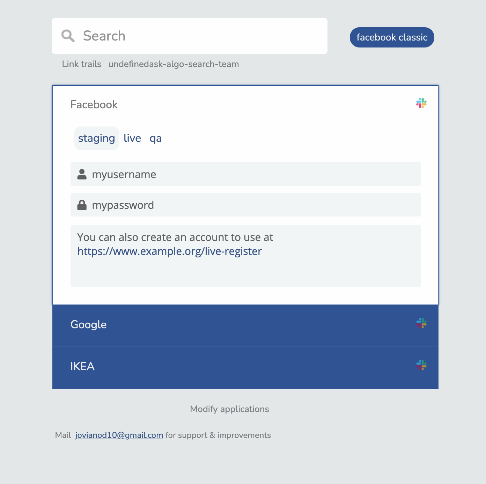

# Team Links
A tool to manage your team's (or personal) application links / bookmarks

Example at https://team-links.herokuapp.com/

Screenshot
---


Install
---

 `npm install`

Configure
---

 Add your application/websites to the [config/my-links.yaml](./config/my-links.yaml) file

Run
---
  
 Run the application `npm start`


Configuration
---

### Base Configuration
```
# Applications
---
title: DieselDC Inc. [optional, used in search text field]
maintainer: https://www.dieseldc.com [optional, used to link maintainer person in app footer]
org_slack_url: https://springernature.slack.com [optional, used to render slack channel links]
github_config: https://github.com/dieseldc/my-links.yaml [optional, used to allows users to edit the yaml file]
```

##### Adding Applications
Under `applications:`, add the following minimum to add a new application to the list

```
applications: 
- name: Facebook [Name of the application] 
  team: Facebook-ReEngineer [optional]
  slack: facebook-engineering [optional, slack channel for the application]
  environments: 
    googol-staging: [Can be anything]
      url: http://www.example.org/google-staging [required]
      login_user: myusername  [optional]
      login_password: mypassword [optional]
      notes: You can also create an account to use at https://www.example.org/live-register [optional]
    googol-live: [additional environments]
      url: http://www.example.org/google-live
      notes: You can also create an account to use at https://www.example.org/staging

- name: Google [Name of the application] 
```